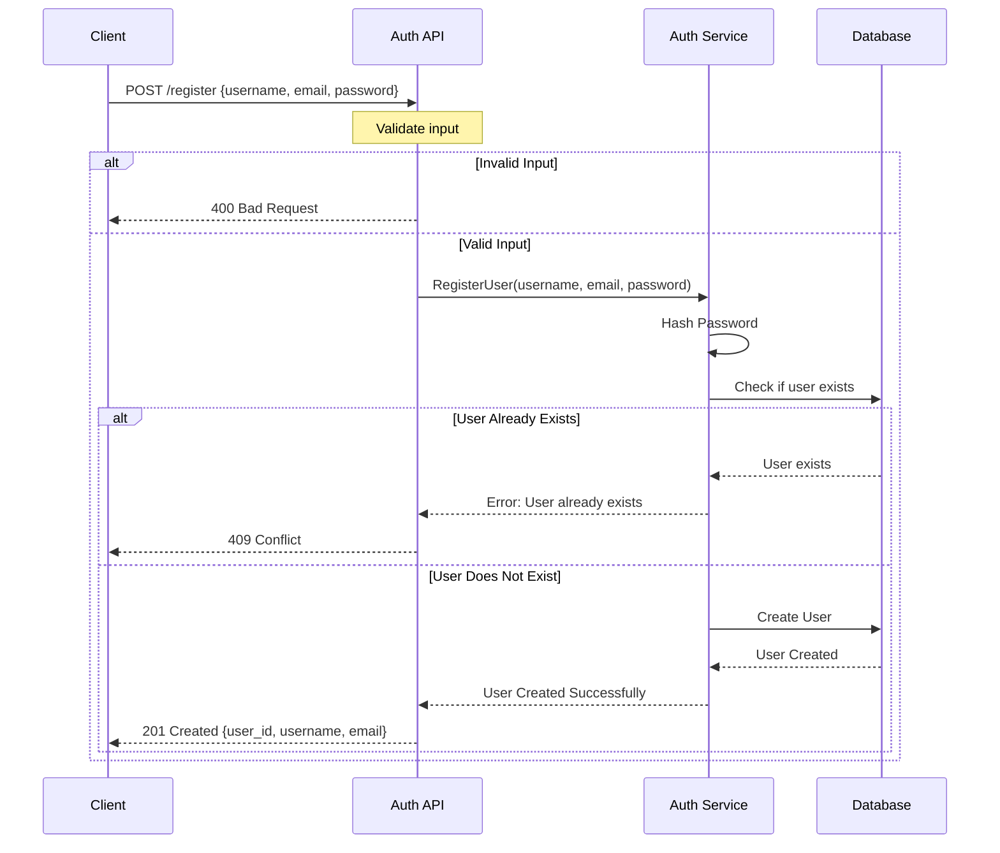
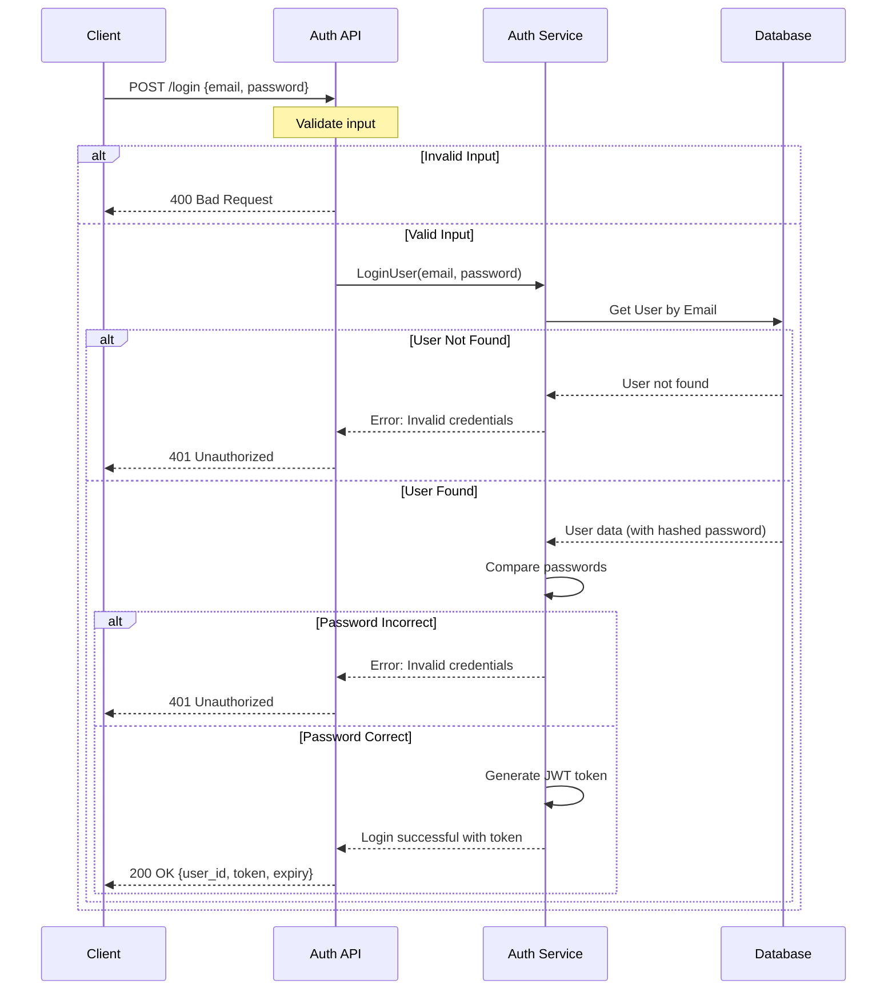
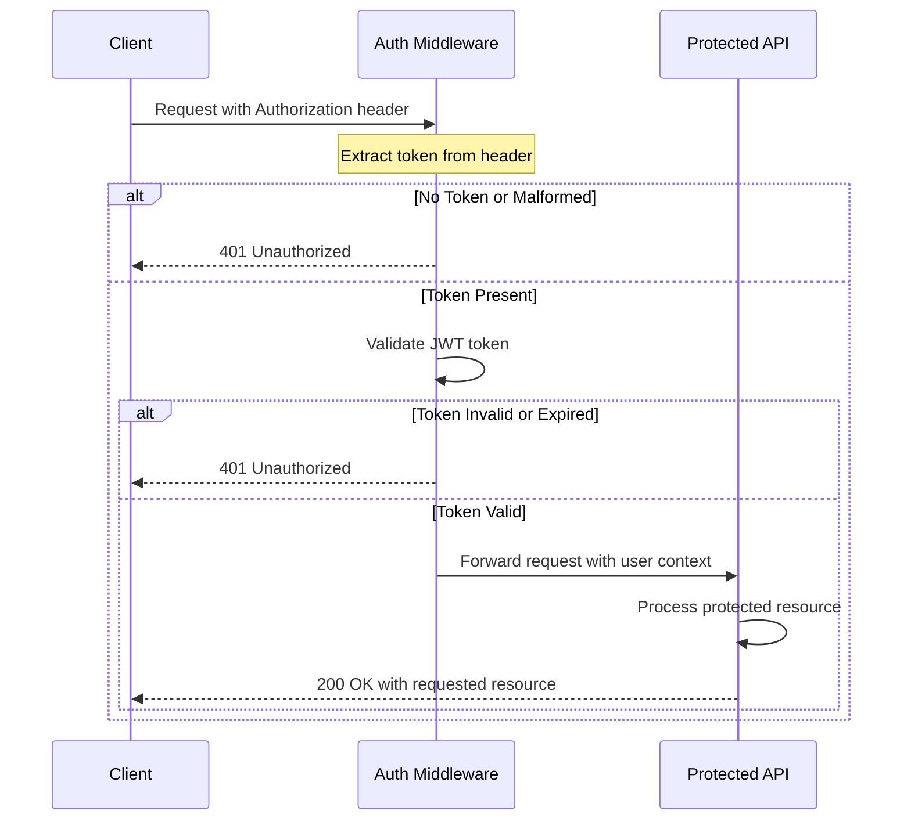
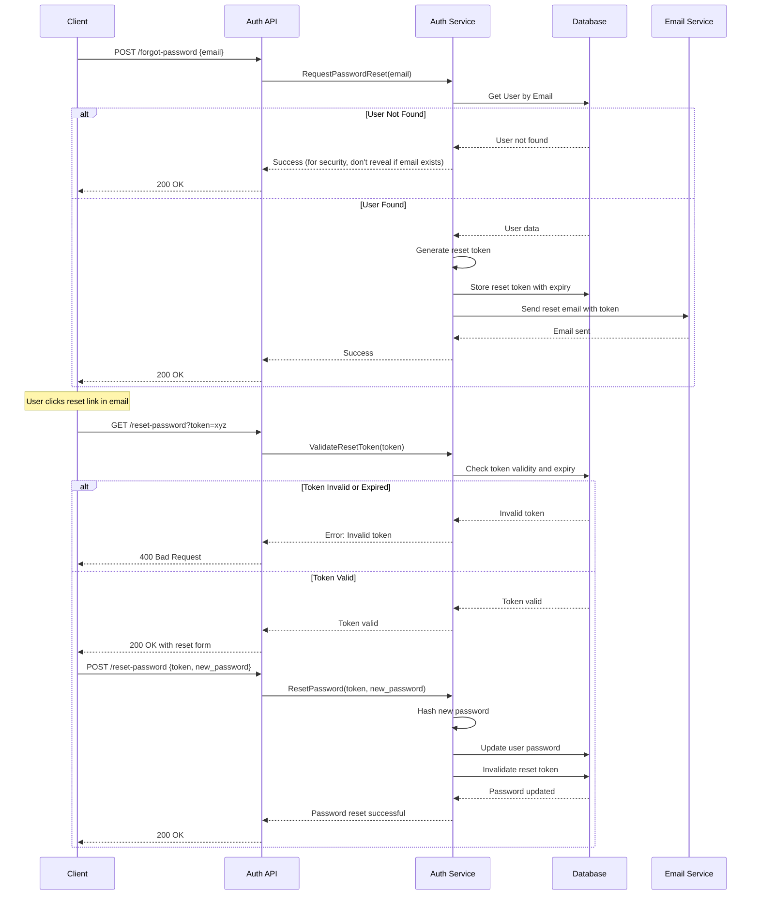

# Authentication Flow Diagram

This document illustrates the flow of registration and login processes in the Authentication Service.

## Registration Flow

## Login Flow

## Token Validation Flow

## Password Reset Flow

