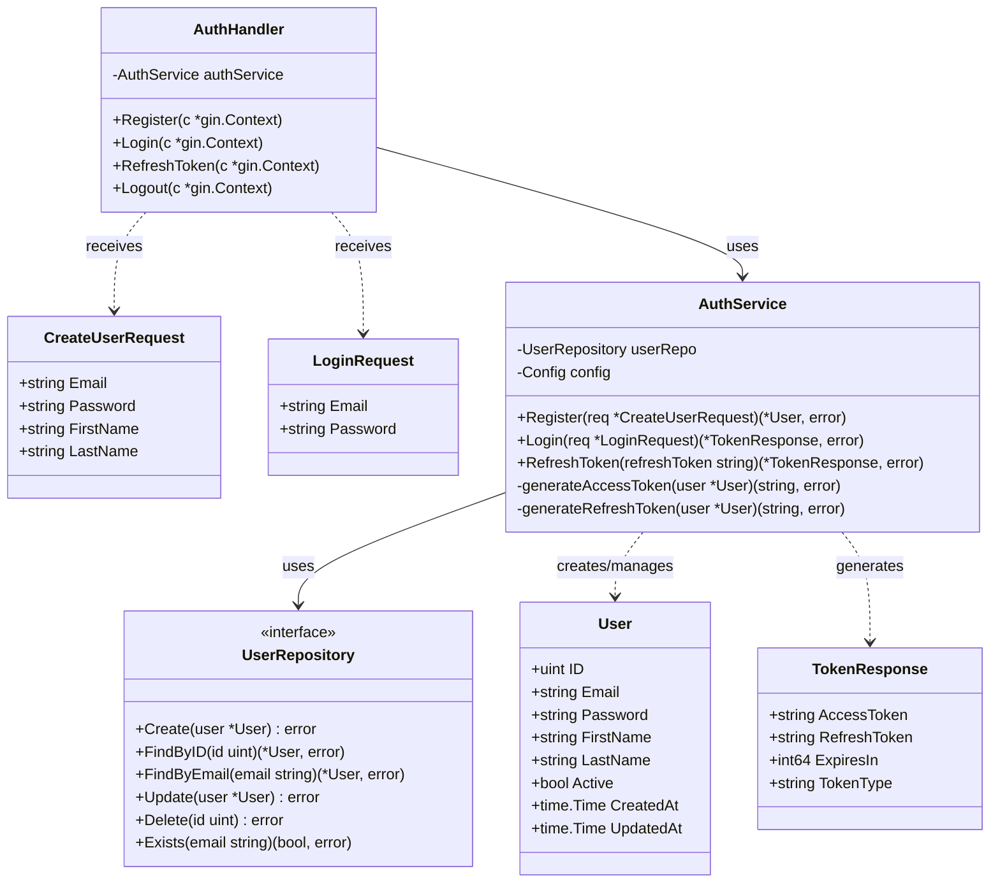
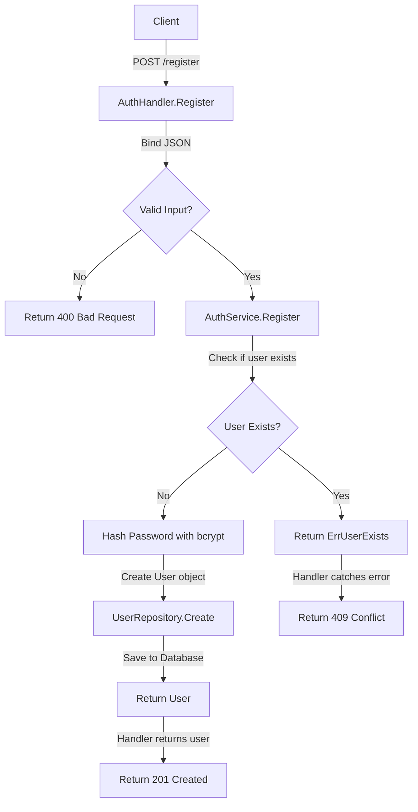
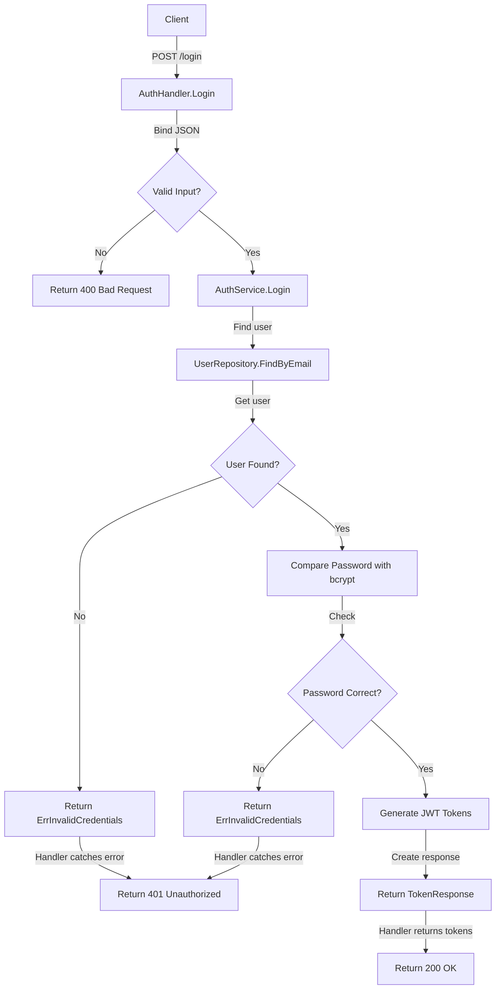
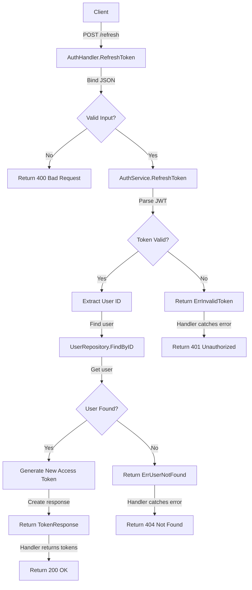
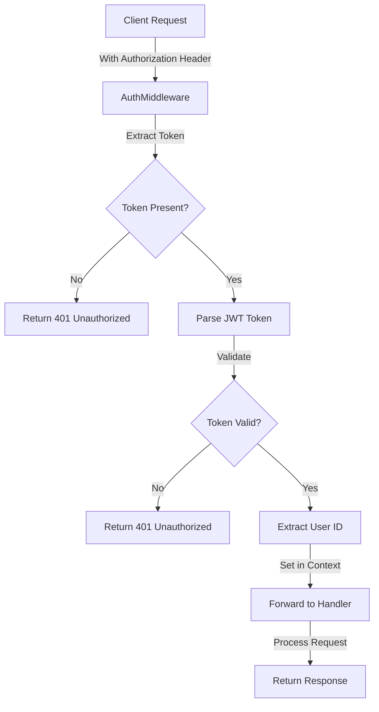

# Authentication Service Implementation Flow

This document illustrates the technical implementation flow of the authentication processes in the codebase.

## Code Architecture

## Registration Implementation Flow

## Login Implementation Flow

## Token Refresh Implementation Flow

## Authentication Middleware Flow

